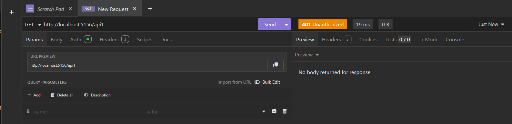

````markdown
# 🚀 Microservices API Gateway with Ocelot

This project demonstrates how to build a **Microservices architecture** with an **API Gateway** using the **Ocelot** library in .NET.  
It includes multiple APIs (API_1, API_2, API_3) and an API Gateway that manages routing, authentication, and authorization.  

---

## 🎯 Features
- Centralized API Gateway using **Ocelot**  
- JWT-based **Authentication & Authorization** for `API_1`  
- Simple downstream routing for `API_2` and `API_3`  
- HTTPS support with trusted developer certificates  
- Tested with **Insomnia** as the client  

---

## 📊 Architecture Overview

```mermaid
flowchart TD
    Client[Client / Insomnia] -->|Request| Gateway[API Gateway (Ocelot)]
    Gateway -->|/api1| API1[API_1 (JWT Auth Required)]
    Gateway -->|/api2| API2[API_2]
    Gateway -->|/api3| API3[API_3]

    API1 -->|Validate Token| AuthDB[(JWT Validation)]
````

---

## ⚙️ Microservices

### 🔑 API_1 - Authentication & Authorization

`API_1` is protected with **JWT tokens**.
Only valid tokens with the correct `Role` claim can access its endpoints.


---

### 🌐 API_2 - Public Service

`API_2` is a simple service that does not require authentication. It can be accessed directly through the gateway.


---

### 📡 API_3 - Public Service

Similar to `API_2`, this service is open and does not enforce authentication.


---

## 🔒 JWT Token Generation

JWT tokens were generated using an online tool with matching **Issuer, Audience, and SecurityKey** defined in the `appsettings.json`.
The token is then added to the request as a **Bearer Token** in Insomnia.


---

## 🧪 Example Errors

During testing, invalid or missing tokens result in proper error responses such as **401 Unauthorized**.



---
